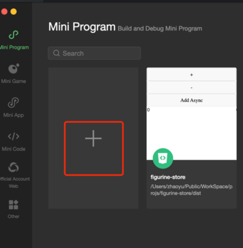
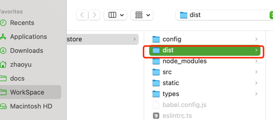
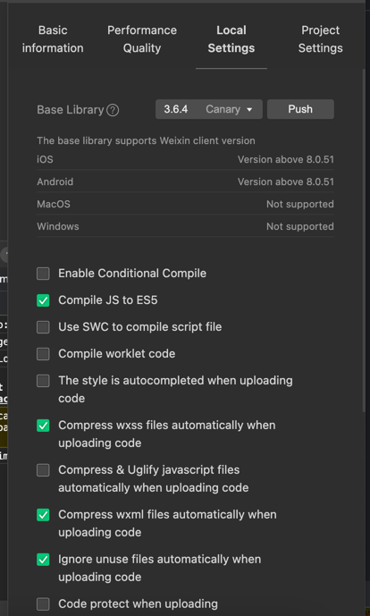

### 项目描述
一个应用商店
### 项目依赖

1. node 版本 v22.4.1 
2. taro 版本 v4.0.7
3. 小程序开发者工具(1.06.2409140 darwin-x64）

### 项目启动
step1:
```shell
$ node -v  ## node用v22
$ npm install 
$ npm run dev:weapp
```
step2: 构建产物导入





step3: 本地编译设置


